# lab0.5

## 练习1

在Makefile文件目录下创建两个终端，启动qemu和gdb。
```
# 终端1
make debug
# 终端2
make gdb
```

在启动gdb的终端有以下信息:

<div style="text-align:center;">
    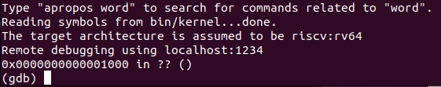
</div>

说明QEMU模拟的RISC-V计算机加电后pc指向0x1000。使用命令 *x/10i $pc* 查看即将执行的10条汇编指令，结果如下:

<div style="text-align:center;">
    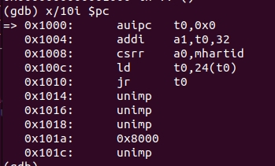
</div>

可以看到此处进行了一些指令操作。首先，auipc指令将当前pc的值和符号扩展后的立即数0x0相加存在t0寄存器中，然后addi指令将t0寄存器的值与立即数32相加的结果赋给a1寄存器，接着使用csrr指令读取M-mode下的mhartid寄存器的值，存储到a0寄存器中。然后ld指令从地址为t0+24处加载64位的数据存储在t0中。最后通过jr指令pc跳转到了t0存储的地址处继续执行。使用 *si* 语句单步执行，*info r t0* 语句查看t0寄存器的值，发现最后t0中的值为0x80000000。说明QEMU模拟的RISC-V计算机加电后，在0x1000进行了一些初始操作，然后跳转到了0x80000000处，即OpenSBI.bin的起始地址。接下来要执行的汇编指令如下:

<div style="text-align:center;">
    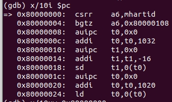
</div>


OpenSBI得到pc后，进行了一系列的操作，然后将pc交给操作系统。在QEMU模拟的RISC-V计算机中，操作系统的入口地址是0x80200000，在此处设置一个断点。

<div style="text-align:center;">
    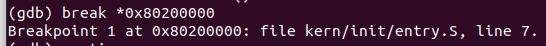
</div>

gdb提示断点位置在kern/init/entry.S,line 7的位置，打开对于文件可知，该行对应kern_entry，即OS的入口地址。

执行命令 *continue* ，qemu终端显示OpenSBI的一些信息，gdb终端停在了0x80200000处。此时，OpenSBI将计算机的控制权交给了操作系统。

<div style="text-align:center;">
    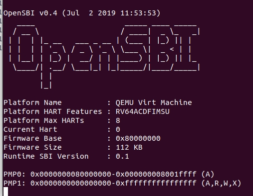
</div>

<div style="text-align:center;">
    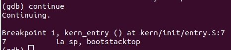
</div>

# lab 1

## 练习1
阅读 kern/init/entry.S内容代码，结合操作系统内核启动流程，说明指令 la sp, bootstacktop 完成了什么操作，目的是什么？ tail kern_init 完成了什么操作，目的是什么？
>la sp, bootstacktop将bootstacktop符号的地址加载到栈指针寄存器，而bootstacktop是全局符号，记录了在操作系统内核启动时开辟的大小为KSTACKSIZE的内核栈的最高地址，即将sp寄存器的值设置为内核栈顶地址。
>tail kern_init使用tail调用kern_init函数，实质上是将当前函数的返回地址替换成了kern_init函数的地址，这样在执行完entry.S后，pc会跳转到kern_init函数执行，而不会返回0x1010。

<div style="text-align:center;">
    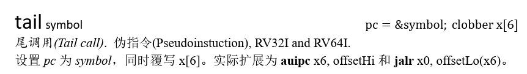
</div>


## 练习2
请编程完善trap.c中的中断处理函数trap，在对时钟中断进行处理的部分填写kern/trap/trap.c函数中处理时钟中断的部分，使操作系统每遇到100次时钟中断后，调用print_ticks子程序，向屏幕上打印一行文字”100 ticks”，在打印完10行后调用sbi.h中的shut_down()函数关机。

要求完成问题1提出的相关函数实现，提交改进后的源代码包（可以编译执行），并在实验报告中简要说明实现过程和定时器中断中断处理的流程。实现要求的部分代码后，运行整个系统，大约每1秒会输出一次”100 ticks”，输出10行。

<div style="text-align:left;">
    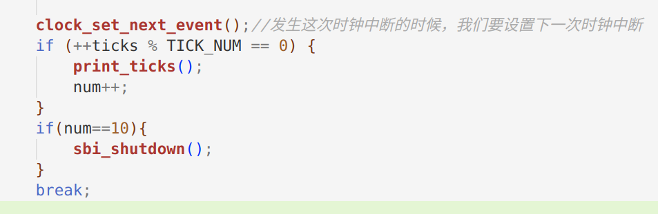
</div>

>1. 收到时钟中断后,首先通过clock_set_next_event()设置下一次的时钟中断,保证可以继续接收到定时时钟中断。
>
>2. 将计数器ticks加1,表示收到了一次时钟中断。
>3. 判断ticks计数是否达到100次时钟中断,如果是100的倍数,就调用print_ticks()打印输出。
>
>4. 打印的次数num也加1,判断是否打印了10次,如果是10次,就调用sbi_shutdown()关机。
>
>5. 最后break跳出中断处理函数。


## Challenge1: 描述与理解中断流程
ucore处理中断异常的流程如下(mov a0，sp的目的是什么？):

>1. 当CPU发生异常或中断时,会根据stvec寄存器的值跳转到__alltraps入口。
>
>2. 在__alltraps中,先用SAVE_ALL宏保存当前的所有通用寄存器的值到栈中,然后保存sstatus、sepc、sbadaddr和scause等CSR寄存器到栈中。
>
>3. 然后调用trap函数处理中断异常,mov a0, sp的目的是把栈指针作为参数传给trap,让trap可以访问保存的寄存器信息。
>
>4. trap函数中的trap_dispatch会判断中断类型,调用相应的处理函数。
>
>5. 处理完成后,返回__trapret恢复先前保存的寄存器,最后执行sret指令从异常返回。

SAVE_ALL中寄寄存器保存在栈中的位置是什么确定的？

>&emsp;&emsp; SAVE_ALL中寄存器保存在栈中的位置是通过栈顶指针及对应的REGBYTE偏移决定的，x0-x31保存从低地址到高地址,sstatus等CSR寄存器保存于x寄存器之后

对于任何中断，__alltraps 中都需要保存所有寄存器吗？

>&emsp;&emsp; 我觉得不一定，只有当中断处理需要保证处理完成后正确恢复先前状态时,才需要保存全部寄存器。如果中断只需要处理自身功能,不需要恢复先前状态,则不需要保存所有寄存器。但是因为我们现在还没有完成PCB，方便起见，把__alltraps作为通用入口,不判断中断类型,保存所有寄存器以确保可正确恢复。


## Challenge2：理解上下文切换机制
回答：在trapentry.S中汇编代码 csrw sscratch, sp；csrrw s0, sscratch, x0实现了什么操作，目的是什么？

csrw sscratch, sp
该指令将栈顶sp的地址存入sscratch寄存器中
csrrw s0, sscratch, x0
该指令将刚才保存的sp的地址存入s0中，并将sscratch寄存器的值置0.
sscratch寄存器规定：若在中断之前处于 U 态(用户态)，保存的是内核栈地址；若中断之前处于 S 态(内核态)，保存的是 0。所以第一条指令是一个用户中断，把栈顶地址sp赋给sscratch；第二条指令将sscratch的值保存在s0中，并将sscratch清零，目的是如果嵌套中断出现时，中断向量知道该中断是来自内核态的。

save all里面保存了stval scause这些csr，而在restore all里面却不还原它们？那这样store的意义何在呢？
这些寄存器的值是为了判断中断类型，中断状态的，只需要在trap内使用，用于正确处理异常，故而不需要还原。需要store是因为需要封装数据结构trapframe传入trap函数进行异常处理，这些寄存器的值也是处理对象。

## Challenge3: 完善异常中断

编程完善在触发一条非法指令异常 mret和ebreak，在 kern/trap/trap.c的异常处理函数中捕获，并对其进行处理，简单输出异常类型和异常指令触发地址，即“Illegal instruction caught at 0x(地址)”，“ebreak caught at 0x（地址）”与“Exception type:Illegal instruction"，“Exception type: breakpoint”。

在trap.c中的exception_handler函数中，有非法指令异常处理和断点异常处理case，故只需要补充完善该部分，不需要新增此异常处理情况。sepc寄存器会记录触发中断的指令的地址，我们需要的异常指令触发地址可通过*tf->sepc*得到，然后调用两次cprintf函数将异常类型信息和异常指令触发地址信息打印即可。最后，我们需要更新epc的值跳过异常指令继续执行。查阅[RISC-V硬件简要手册-中文](http://staff.ustc.edu.cn/~llxx/cod/reference_books/RISC-V-Reader-Chinese-v2p12017.pdf)可知，mert和ebreak指令都是32位，故只要将epc的值加上4，就能完整实现异常处理功能了。

<div style="text-align:center;">
    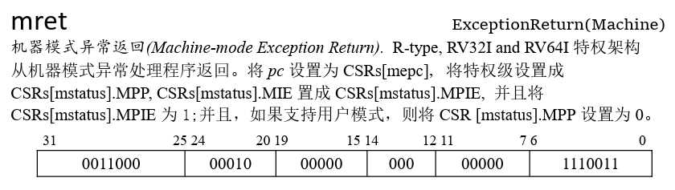
</div>

<div style="text-align:center;">
    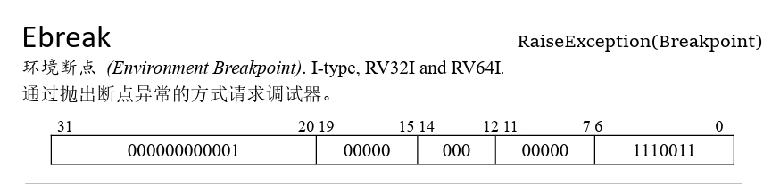
</div>

接下来需要加入异常触发语句。首先考虑异常触发语句的位置，肯定是要在kern_init函数中调用idt_init初始化中断函数后才能正常处理异常触发。而后的时钟中断则与这两种异常无关了，故异常触发语句只需要添加在调用idt_init函数后即可。于是我们便考虑通过内联汇编将 *mret* 和 *ebreak* 汇编指令加入idt_init调用后。
```
asm volatile("mret");
asm volatile("ebreak");
```

指导手册中告诉了我们，mret是用于 M 态中断返回到 S 态或 U 态，是特权指令，而我们的程序运行时并不是机器模式，故此处添加volatile关键字确保该语句不会被编译器优化掉。

执行```make qemu```查看结果。
<div style="text-align:center;">
    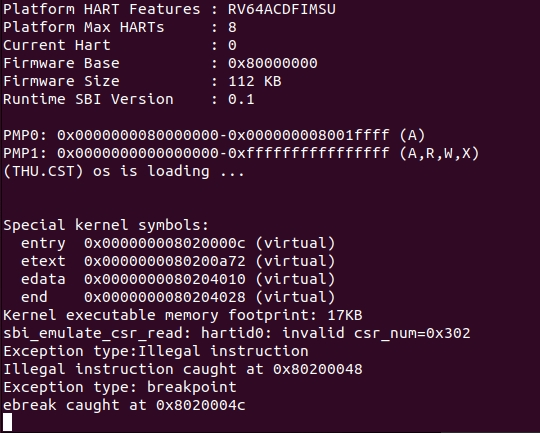
</div>

程序运行到打印出断点异常触发地址后便不动了，并不是预期的接着执行时间中断，说明要么是epc没有指向正确的下一条指令，要么是clock_init函数出问题了。但是我们知道clock_init函数中的值并没有在非法指令异常或者断点异常处理中进行修改，所以问题应该是出在epc指向了错误的下一条指令地址。

继续查阅[RISC-V硬件简要手册-中文](http://staff.ustc.edu.cn/~llxx/cod/reference_books/RISC-V-Reader-Chinese-v2p12017.pdf)，发现在ebreak之外还有另一条指令: c.ebreak。
<div style="text-align:center;">
    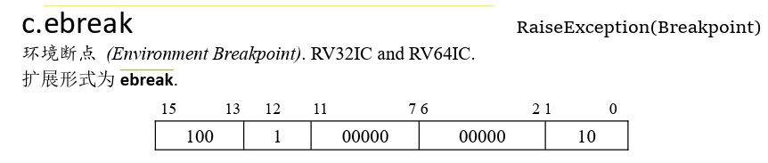
</div>
该指令和ebreak的功能是一样的，用于触发断点异常。但是c.ebreak指令只需要16位，以更紧凑的形式表示，而不需要使用标准指令的32位编码。故考虑将断点异常处理中的epc的值加上2，而不是4。

再次执行```make qemu```，结果如下。
<div style="text-align:center;">
    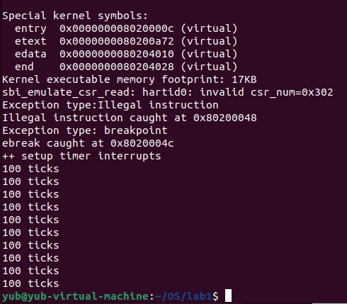
</div>
在分别输出了mret和ebreak异常类型和异常指令触发地址后，继续执行时钟中断直到退出，说明实现了异常处理功能。