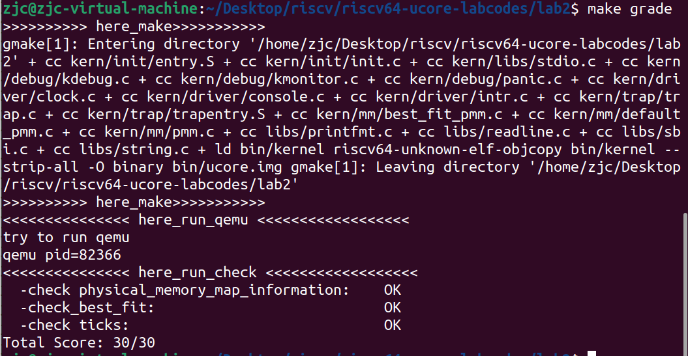

# lab2

## 练习1：理解first-fit 连续物理内存分配算法（思考题）

first-fit 连续物理内存分配算法作为物理内存分配一个很基础的方法，需要同学们理解它的实现过程。请大家仔细阅读实验手册的教程并结合kern/mm/default_pmm.c中的相关代码，认真分析default_init，default_init_memmap，default_alloc_pages，default_free_pages等相关函数，并描述程序在进行物理内存分配的过程以及各个函数的作用。 请在实验报告中简要说明你的设计实现过程。请回答如下问题：

+ 你的first fit算法是否有进一步的改进空间？

First Fit（最先匹配）是一种常见的内存分配算法。其基本原理是：存储管理器沿着段链表进行搜索，直到找到一个够大的空闲区，除非空闲区大小和要分配的空间大小正好一样，否则将该空闲区分为两部分，一部分供进程使用，另一部分形成新的空闲区。首次适配算法是一种速度很快的算法，因为它尽可能少地搜索链表结点。缺点是会导致内存碎片化，即剩余的小块无法满足大块的请求。以及如果较大的空闲块位于链表或数组的末尾，那么查找合适的空闲块可能需要较长的时间。

### default_init函数分析
代码如下：
```c
static void
default_init(void) {
    list_init(&free_list);
    nr_free = 0;
}
```
+ `list_init(&free_list)`：这行代码调用list_init的函数，参数为指向free_list的指针。意在将free_list空闲链表初始化成一个空链表。

+ `nr_free = 0`：将空闲页数量置为0(因为还没开始计算空闲页的数量，所以是0)。
#### 综上，可以实现将空闲内存块列表初始化为空链表，并将空闲内存块的数量设置为0，达到初始化管理器结构的作用。
### default_init_memmap函数分析
代码如下：
```c
static void
default_init_memmap(struct Page *base, size_t n) {
    assert(n > 0);
    struct Page *p = base;
    for (; p != base + n; p ++) {
        assert(PageReserved(p));
        p->flags = p->property = 0;
        set_page_ref(p, 0);
    }
    base->property = n;
    SetPageProperty(base);
    nr_free += n;
    if (list_empty(&free_list)) {
        list_add(&free_list, &(base->page_link));
    } else {
        list_entry_t* le = &free_list;
        while ((le = list_next(le)) != &free_list) {
            struct Page* page = le2page(le, page_link);
            if (base < page) {
                list_add_before(le, &(base->page_link));
                break;
            } else if (list_next(le) == &free_list) {
                list_add(le, &(base->page_link));
            }
        }
    }
}
```
+ 参数为一个页的基址base和页的数量n
+ 通过`assert(n > 0);`断言n>0,确保页的数量大于0。
+ 第一个for循环遍历从base开始的n个页表，将这些页表的属性进行初始化。
+ 通过`assert(PageReserved(p));`断言检查当前页表是否为保留页。若否，则引发错误（因为先前已利用`SetPageReserved(pages + i);`将所有的page都设置为保留页了）；若是，则将非保留页的flags和proterty设为0，表示没有特殊标记和属性，通过set_page_ref(p, 0)将页表的引用计数设置为0，表示还没有被引用；
+ 循环结束后，将第基址base处的页表property属性设置为n，表示这一段物理内存的连续页数。使用SetPageProperty(base)函数将base页表的flags的PG_property标志位置为1，表示该页面是一个空闲内存块的头部页面，可以在 alloc_pages 中使用。随后将nr_free的值加上n，表示增加了n个空闲块。
+ 接下来判断free_list是否为空。若是，则直接使用list_add函数将base页表插入作为链表的第一个节点；若否，则进入while循环，寻找合适的位置插入。
+ `list_entry_t* le = &free_list;`初始化一个指针le，指向free_list的头部节点。在while循环中，首先使用le2page宏将le转换为struct Page类型的指针page，方便访问节点的属性；随后判断base是否小于page：若是，则使用list_add_before(le, &(base->page_link))将base->page_link插入到le节点之前，并跳出循环；若否，则继续遍历链表，直到le的下一个节点为free_list，说明已经遍历到了链表的尾部，使用list_add(le, &(base->page_link))将base->page_link插入到le节点之后。跳出循环
#### 综上，该函数用于初始化一段连续的物理页块，并将其按一定规则插入到空闲链表中。
### default_alloc_pages函数
代码如下：
```c
static struct Page *
default_alloc_pages(size_t n) {
    assert(n > 0);
    if (n > nr_free) {
        return NULL;
    }
    struct Page *page = NULL;
    list_entry_t *le = &free_list;
    while ((le = list_next(le)) != &free_list) {
        struct Page *p = le2page(le, page_link);
        if (p->property >= n) {
            page = p;
            break;
        }
    }
    if (page != NULL) {
        list_entry_t* prev = list_prev(&(page->page_link));
        list_del(&(page->page_link));
        if (page->property > n) {
            struct Page *p = page + n;
            p->property = page->property - n;
            SetPageProperty(p);
            list_add(prev, &(p->page_link));
        }
        nr_free -= n;
        ClearPageProperty(page);
    }
    return page;
}
```
default_alloc_pages()是为了分配page而设计的函数，参数为n，表示需要分配页的大小。
实现：

+ 通过断言 `assert(n > 0);`确保n大于0；并且确保free页大于n，否则`return NULL;`。
+ 第一个while循环，从空闲链表开始查找，找到第一块符合条件(p->property >= n)的空闲空间返回。
+ 随后，为避免空间浪费，需要将多余的空闲空间重新分割出来。即property>n时，将大于n的部分重新加入到空闲列表中。
+ 具体做法是先将base变为page+n的地方（此时对应的Page为p），然后将此时的property-n，将此时的p加入空闲链表中，再将page从空闲链表中删除。
#### 综上，default_alloc_memmap函数主要就是从空闲页块的链表中遍历，找到第一块大小大于等于 n 的块分配出来，然后把它从空闲页链表中除去，如果有多余的，把分完剩下的部分再次加入会空闲页链表中。


### default_free_pages函数
代码如下：
```c
static void
default_free_pages(struct Page *base, size_t n) {
    assert(n > 0);
    struct Page *p = base;
    for (; p != base + n; p ++) {
        assert(!PageReserved(p) && !PageProperty(p));
        p->flags = 0;
        set_page_ref(p, 0);
    }
    base->property = n;
    SetPageProperty(base);
    nr_free += n;

    if (list_empty(&free_list)) {
        list_add(&free_list, &(base->page_link));
    } else {
        list_entry_t* le = &free_list;
        while ((le = list_next(le)) != &free_list) {
            struct Page* page = le2page(le, page_link);
            if (base < page) {
                list_add_before(le, &(base->page_link));
                break;
            } else if (list_next(le) == &free_list) {
                list_add(le, &(base->page_link));
            }
        }
    }

    list_entry_t* le = list_prev(&(base->page_link));
    if (le != &free_list) {
        p = le2page(le, page_link);
        if (p + p->property == base) {
            p->property += base->property;
            ClearPageProperty(base);
            list_del(&(base->page_link));
            base = p;
        }
    }

    le = list_next(&(base->page_link));
    if (le != &free_list) {
        p = le2page(le, page_link);
        if (base + base->property == p) {
            base->property += p->property;
            ClearPageProperty(p);
            list_del(&(p->page_link));
        }
    }
}
```
+ 参数：`base`:将要释放的空间基址；`n`:页的数量

实现过程：
+ 首先，通过断言 assert(n > 0) 来确保释放页面的数量 n 大于零，以防止错误的参数输入。
+ 接下来，使用for循环遍历从 base 开始到 base + n 结束的页面范围。在循环中，它首先通过断言 assert(!PageReserved(p) && !PageProperty(p)) 确保要释放的页面既不是保留的也不是属性页，然后将页面的标志设置为0，并将引用计数设置为0。
+ 继而，函数更新 base 页面的属性为 n，表示这片页面的长度为 n。然后，它调用 SetPageProperty(base) 将页面标记为属性页，并将 n 的值增加到全局变量 nr_free 中。
+ 接下来，函数检查空闲页链表 free_list 是否为空。如果为空，它将 base 页面添加到链表中。否则，它遍历链表查找适当的位置，将 base 页面插入到相应的位置上（同default_init_memmap函数）。
+ 接下来，函数通过检查 base 页面的前一个页面（通过 list_prev 获取）是否与 base 页面相邻，如果是的话，则将它们合并为一个大的页面。
+ 最后，函数通过检查 base 页面的后一个页面（通过 list_next 获取）是否与 base 页面相邻，如果是的话，则将它们合并为一个大的页面。

#### 综上，default_free_pages 函数是一个用于释放一页或多页的连续内存的实现。它负责更新页面的属性，处理空闲页链表，并合并相邻的空闲页面以提高内存利用率。
### first fit算法的改进空间
+ 在内存分配和释放操作中，基于双向链表进行操作的时间复杂度为O(n)。然而，若利用二叉搜索树对地址进行排序，以对进程进行管理，可将查找页块的时间复杂度降至O(logn)。
+ 使用多个空闲块链表来管理不同大小范围的空闲块。根据空闲块的大小将它们分别放入对应的链表中，在分配时可优先从大小适配的链表中查找空闲块，减少在整个空闲块链表中搜索的时间。


## 练习2：实现 Best-Fit 连续物理内存分配算法（需要编程）

在完成练习一后，参考kern/mm/default_pmm.c对First Fit算法的实现，编程实现Best Fit页面分配算法，算法的时空复杂度不做要求，能通过测试即可。 请在实验报告中简要说明你的设计实现过程，阐述代码是如何对物理内存进行分配和释放，并回答如下问题：

+ 你的 Best-Fit 算法是否有进一步的改进空间？

查阅资料可以看到

> Best Fit算法是一种用于内存分配的策略，通常用于操作系统中，用于将进程或任务分配给可用内存块。这个算法的目标是使内存分配尽可能高效，以减少内存碎片的产生。
在每次分配内存时，选择最小的合适块，以便剩下的内存块尽可能大。以下是Best Fit算法的主要流程：
> 
> - 初始化：开始时，整个可用内存被视为一个大块。所有的内存块都被标记为未分配状态。
> 
> - 当一个进程或任务请求内存时，操作系统会遍历所有可用内存块，以找到能够容纳请求大小的最小块。这个块被标记为已分配，并从中减去请求的内存大小。这个块的剩余部分可能会变成一个新的未分配块。
> 
> - 如果没有足够大的内存块来容纳请求的大小，系统会等待，直到有足够的内存块可供分配。或者，操作系统可以选择终止请求的进程或任务，具体取决于操作系统策略。
> 
> - 当一个进程释放内存时，操作系统会将被释放的内存块标记为未分配状态，并尝试合并相邻的未分配块，以减少碎片化。

我们要在First Fit算法的基础上来实现Best Fit算法，Best Fit算法要将分区按小大顺序组织,找到的第一个适应分区是大小与要求相差最小的空闲分区。但是因为在初始化空闲链表时我们采用的从低地址到高地址的排列，所以使用小大顺序组织就不太现实，我们退一步，用时间换空间。首先设置min_size（理论上是大小与要求相差最小的空闲页数）为总的空闲页数+1，遍历整个空闲链表，当空闲块的属性值大于要开辟的n时，再加入一个判断条件p->property < min_size，如果成立则说明满足条件的同时min_size还可以更小，更接近要求开辟的页数，使用此时我们用满足条件的p->property重新赋给min_size。所以我们可以看到算法的时间复杂度为O（n），实现了找到的分区是大小与要求相差最小的空闲分区.

从上面的分析可以看出，在default_pmm的基础上，我们主要更改的是best_fit_alloc_pages函数，其他部分应该可以沿用，前面分析过了，这里就不赘述了。

```c
static struct Page *
best_fit_alloc_pages(size_t n) {
    // 检查分配页数是否大于0
    assert(n > 0);

    // 如果需要的页数大于可用空闲页数，无法满足分配请求，返回NULL
    if (n > nr_free) {
        return NULL;
    }

    // 初始化指向找到的页框为NULL，用于记录满足需求的页框
    struct Page *page = NULL;

    // 初始化指向空闲链表的指针
    list_entry_t *le = &free_list;

    // 初始化记录找到的最小连续空闲页框数量
    size_t min_size = nr_free + 1;

    // 遍历空闲链表，查找满足需求的空闲页框
    while ((le = list_next(le)) != &free_list) {
        // 获取当前空闲页框对应的Page结构
        struct Page *p = le2page(le, page_link);

        // 如果当前空闲页框的大小大于等于需求的页数，并且小于记录的最小大小
        if (p->property >= n && p->property < min_size) {
            // 更新找到的满足需求的页框和最小大小
            page = p;
            min_size = p->property;
            //关键在于遍历，虽然时间复杂度稍高但等效于排序
        }
    }

    // 如果找到满足需求的页框
    if (page != NULL) {
        // 获取找到页框的前一个页框在链表中的位置
        list_entry_t* prev = list_prev(&(page->page_link));

        // 从空闲链表中删除找到的页框
        list_del(&(page->page_link));

        // 如果找到的页框大小大于需求页数，拆分剩余部分为新的空闲页框
        if (page->property > n) {
            // 计算剩余部分的页框指针
            struct Page *p = page + n;

            // 设置剩余部分的属性信息和大小
            p->property = page->property - n;
            SetPageProperty(p);

            // 将剩余部分的页框添加到链表中
            list_add(prev, &(p->page_link));
        }

        // 更新可用空闲页数
        nr_free -= n;

        // 清除找到的页框的属性标记，表示已分配
        ClearPageProperty(page);
    }

    // 返回找到的满足需求的页框（如果有的话）
    return page;
}


```

运行结果如下，成功：




综上，Best Fit算法的优点和缺点为：尽量减少了内存碎片，因为它选择最适合请求大小的块，但这也使得它的效率较低，因为它需要遍历所有可用内存块来找到最小的适合块。此外，由于块的分割和合并，这可能导致内存分配表的维护成本较高。

可以优化的方向有：

改进Best Fit算法的效率： 目前Best Fit算法的实现需要遍历整个空闲内存链表以找到适合的内存块。这可以通过使用更高效的数据结构来改进，如平衡二叉树或优先队列，这将减少查找时间并提高性能。

维护有序性： 在Best Fit算法中，维护内存块的有序性可以降低算法复杂度，我们可以通过确保空闲内存块链表保持有序，以减少查找时间，在初始化内存块和释放内存块时维护。


## 扩展练习Challenge：硬件的可用物理内存范围的获取方法（思考题）
+ 如果 OS 无法提前知道当前硬件的可用物理内存范围，请问你有何办法让 OS 获取可用物理内存范围？

在无法提前知道当前硬件可用物理内存范围的情况下，操作系统可以通过以下方法来获取可用物理内存范围：

1、ACPI（高级配置和电源接口）：操作系统可以使用 ACPI 来获取关于硬件设备和系统配置的信息，包括可用的物理内存范围。ACPI 提供了一个固件接口，可以向操作系统报告系统的物理内存布局。

2、BIOS 或 UEFI 接口：操作系统可以通过与计算机的基本输入/输出系统 (BIOS) 或统一的可扩展固件接口 (UEFI) 通信，以获取关于物理内存范围的信息。这些接口通常提供硬件相关的信息和系统配置。

3、内存探测算法：操作系统可以使用内存探测算法来动态地探测系统的物理内存范围。这种方法涉及特定的硬件访问技术和算法来扫描和识别可用的物理内存块。

4、探测硬件设备：操作系统可以与硬件设备进行通信，以获取关于物理内存范围的信息。例如，操作系统可以与内存控制器或其他关键设备进行通信，以确定可用的物理内存区域。

