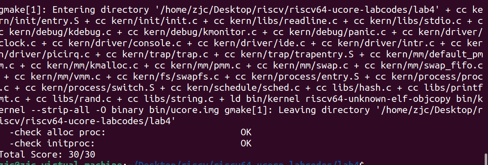

### 练习2：为新创建的内核线程分配资源（需要编码）
设计实现过程在实验指导书书中已经详细给出了，大致就是：调用alloc_proc，首先获取用户信息块，然后setup_kstack为进程分配一个内核栈。接着，将原进程的内存管理信息复制到新进程，并将原进程的上下文复制到新进程。随后，将新进程添加到进程列表中，唤醒新进程，并最终返回新进程号。
```C
int
do_fork(uint32_t clone_flags, uintptr_t stack, struct trapframe *tf) {
    int ret = -E_NO_FREE_PROC;
    struct proc_struct *proc;
    if (nr_process >= MAX_PROCESS) {
        goto fork_out;
    }
    ret = -E_NO_MEM;

    if((proc = alloc_proc())==NULL){ //分配并初始化进程控制块
        goto fork_out;
    }
    proc->parent = current; //将子进程的父节点设置为当前进程
    if((setup_kstack(proc)!=0)){ //分配并初始化内核栈
        goto bad_fork_cleanup_proc;
    }
    if (copy_mm(clone_flags, proc) != 0) { //根据clone_flags决定是复制还是共享内存管理系统
        goto bad_fork_cleanup_kstack;
    }

    copy_thread(proc, stack, tf); //设置进程的中断帧和上下文

    proc->pid = get_pid();

    hash_proc(proc);
    list_add(&proc_list, &(proc->list_link)); //把设置好的进程加入链表
    nr_process ++; //全局线程的数目+1

    wakeup_proc(proc); //将新建的进程设为就绪态
    ret = proc->pid; //将返回值设为线程id

fork_out:
    return ret;

bad_fork_cleanup_kstack:
    put_kstack(proc);
bad_fork_cleanup_proc:
    kfree(proc);
    goto fork_out;
}
```

#### 请说明ucore是否做到给每个新fork的线程一个唯一的id？请说明你的分析和理由。

ucore可以做到每个新fork的线程唯一，从关键代码我们可以看出，如果```if (proc->pid == last_pid)```，之后会```++last_pid```，说明一旦循环时出现线程号相等的情况就会立刻自增，不会构造出重复的pid。
```C
static int
get_pid(void) {
    ...
    repeat:
    //PID 的确定过程中会检查所有进程的 PID，确保唯一
        le = list;
        while ((le = list_next(le)) != list) {
            proc = le2proc(le, list_link);
            if (proc->pid == last_pid) {  //确保新进程的pid不会与last_pid相等
                if (++ last_pid >= next_safe) { //自增
                    if (last_pid >= MAX_PID) {
                        last_pid = 1;
                    }
                    next_safe = MAX_PID;
                    goto repeat;
                }
            }
            else if (proc->pid > last_pid && next_safe > proc->pid) {
                next_safe = proc->pid;
            }
        }
    }
    return last_pid;
}
```


### 实验结果

make qemu
](<屏幕截图 2023-11-19 160616.png>)


make grade
