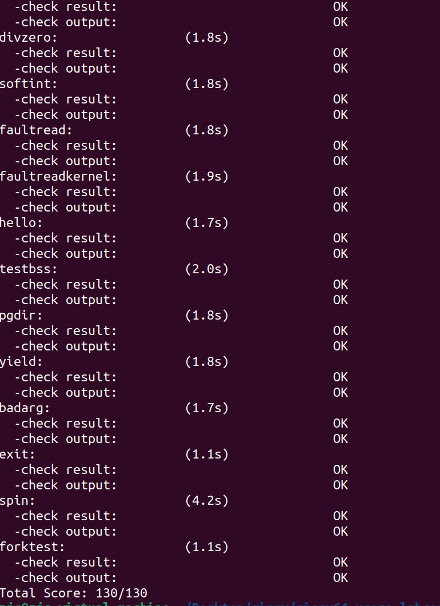

# 练习

 对实验报告的要求：

- 基于markdown格式来完成，以文本方式为主
- 填写各个基本练习中要求完成的报告内容
- 列出你认为本实验中重要的知识点，以及与对应的OS原理中的知识点，并简要说明你对二者的含义，关系，差异等方面的理解（也可能出现实验中的知识点没有对应的原理知识点）
- 列出你认为OS原理中很重要，但在实验中没有对应上的知识点

## 练习0：填写已有实验

本实验依赖实验2/3/4。请把你做的实验2/3/4的代码填入本实验中代码中有“LAB2”/“LAB3”/“LAB4”的注释相应部分。注意：为了能够正确执行lab5的测试应用程序，可能需对已完成的实验2/3/4的代码进行进一步改进。

## 练习1: 加载应用程序并执行（需要编码）

do_execv函数调用load_icode（位于kern/process/proc.c中）来加载并解析一个处于内存中的ELF执行文件格式的应用程序。你需要补充load_icode的第6步，建立相应的用户内存空间来放置应用程序的代码段、数据段等，且要设置好proc_struct结构中的成员变量trapframe中的内容，确保在执行此进程后，能够从应用程序设定的起始执行地址开始执行。需设置正确的trapframe内容。

请在实验报告中简要说明你的设计实现过程。

- 请简要描述这个用户态进程被ucore选择占用CPU执行（RUNNING态）到具体执行应用程序第一条指令的整个经过。


## 练习2: 父进程复制自己的内存空间给子进程（需要编码）

创建子进程的函数do_fork在执行中将拷贝当前进程（即父进程）的用户内存地址空间中的合法内容到新进程中（子进程），完成内存资源的复制。具体是通过copy_range函数（位于kern/mm/pmm.c中）实现的，请补充copy_range的实现，确保能够正确执行。

请在实验报告中简要说明你的设计实现过程。

在`do_fork`函数中，首先通过`alloc_proc`为子进程分配一个新的进程控制块，然后通过`setup_kstack`设置内核栈，接着调用`copy_mm`函数将当前进程的用户内存地址空间复制到新进程。

在`copy_mm`函数中，根据参数`clone_flags`确定是共享父进程的内存地址空间还是复制一个相同的内存地址空间，详细分析见以下代码注释。
```c++
static int copy_mm(uint32_t clone_flags, struct proc_struct *proc) {
    struct mm_struct *mm, *oldmm = current->mm;

    /* current is a kernel thread */
    if (oldmm == NULL) {
        return 0;
    }
    // 如果是共享父进程的内存地址空间，则直接将mm指向oldmm
    if (clone_flags & CLONE_VM) {
        mm = oldmm;
        goto good_mm;
    }
    int ret = -E_NO_MEM;
    //如果是复制内存地址空间，首先创建一个新的内存地址空间
    if ((mm = mm_create()) == NULL) {
        goto bad_mm;
    }
    //然后创建新的页目录
    if (setup_pgdir(mm) != 0) {
        goto bad_pgdir_cleanup_mm;
    }
    //首先使用lock_mm给oldmm加锁，确保复制 oldmm 结构的时候
    //其他进程不会修改 oldmm 结构，从而保证复制的正确性和一致性。
    lock_mm(oldmm);
    {
        ret = dup_mmap(mm, oldmm);
    }
    unlock_mm(oldmm);

    if (ret != 0) {
        goto bad_dup_cleanup_mmap;
    }

good_mm:
    //增加访问次数，然后将子线程的mm设置为得到的mm
    //子线程的页表设置为该mm的页表
    mm_count_inc(mm);
    proc->mm = mm;
    proc->cr3 = PADDR(mm->pgdir);
    return 0;
bad_dup_cleanup_mmap:
    exit_mmap(mm);
    put_pgdir(mm);
bad_pgdir_cleanup_mm:
    mm_destroy(mm);
bad_mm:
    return ret;
}
```
可以看到，将oldmm复制给新建mm的过程是由`dup_mmap`函数实现的。

在`dup_mmap`函数中，首先遍历了源进程的内存映射链表，对每个vma创建了一个新的VMA nvma，将新的nvma插入目标进程的vma链表中。最后调用`copy_range`函数，将源进程的内存地址空间复制到目标进程的内存地址空间。
```c++
int copy_range(pde_t *to, pde_t *from, uintptr_t start, uintptr_t end,
               bool share) {
    //断言检验start和end是否是页对齐的，该地址范围是否在用户空间内
    assert(start % PGSIZE == 0 && end % PGSIZE == 0);
    assert(USER_ACCESS(start, end));
    //以页为单位复制源地址空间内的内容
    do {
        //获取源进程页表项，若ptep为空，说明在源进程中没有找到对应的页表项
        //向下对齐 start 到下一个页表边界
        pte_t *ptep = get_pte(from, start, 0), *nptep;
        if (ptep == NULL) {
            start = ROUNDDOWN(start + PTSIZE, PTSIZE);
            continue;
        }
        //对有效页，，则在目的进程中查找或创建页表项
        //创造页表项后,将源page的内容复制到目的page
        if (*ptep & PTE_V) {
            if ((nptep = get_pte(to, start, 1)) == NULL) {
                return -E_NO_MEM;
            }
            uint32_t perm = (*ptep & PTE_USER);
            // get page from ptep
            struct Page *page = pte2page(*ptep);
            // alloc a page for process B
            struct Page *npage = alloc_page();
            assert(page != NULL);
            assert(npage != NULL);
            int ret = 0;
            //获取源page的虚拟地址
            void *src_kvaddr = page2kva(page);
            //获取目的page的虚拟地址
            void *dst_kvaddr = page2kva(npage);
            //复制数据
            memcpy(dst_kvaddr, src_kvaddr, PGSIZE);
            //将该页面插入目的进程对应的PTE
            ret = page_insert(to, npage, start, perm);
            assert(ret == 0);
        }
        start += PGSIZE;
    } while (start != 0 && start < end);
    return 0;
}
```


### 如何设计实现Copy on Write机制？给出概要设计，鼓励给出详细设计。

  Copy-on-write（简称COW）的基本概念是指如果有多个使用者对一个资源A（比如内存块）进行读操作，则每个使用者只需获得一个指向同一个资源A的指针，就可以该资源了。若某使用者需要对这个资源A进行写操作，系统会对该资源进行拷贝操作，从而使得该“写操作”使用者获得一个该资源A的“私有”拷贝—资源B，可对资源B进行写操作。该“写操作”使用者对资源B的改变对于其他的使用者而言是不可见的，因为其他使用者看到的还是资源A。

具体见`Challenge1`部分。

## 练习3: 阅读分析源代码，理解进程执行 fork/exec/wait/exit 的实现，以及系统调用的实现（不需要编码）

请在实验报告中简要说明你对 fork/exec/wait/exit函数的分析。并回答如下问题：

- 请分析fork/exec/wait/exit的执行流程。重点关注哪些操作是在用户态完成，哪些是在内核态完成？内核态与用户态程序是如何交错执行的？内核态执行结果是如何返回给用户程序的？
- 请给出ucore中一个用户态进程的执行状态生命周期图（包执行状态，执行状态之间的变换关系，以及产生变换的事件或函数调用）。（字符方式画即可）


### 执行流程

* 首先对四个函数进行一下简单的总结：在 user/libs/ulib.h 中，xx 函数被定义为对系统调用用户态接口 sys_xx（user/libs/syscall.c）的封装。首先用户态负责发出中断，当调用 xx 函数时，相当于执行中断处理流程，将控制权将转交给 syscall（user/libs/syscall.c），在函数内部通过内联汇编传递参数后执行 ecall，触发 trap，并进入内核态进行异常处理，之后的操作在内核态完成直到返回。在 trap.c 中，通过 exception_handler 处理句柄唤起对应的系统调用函数 sys_xx（kern/syscall/syscall.c），然后根据系统调用编号转发给 proc.c 中对应的的 do_xx 函数，执行完成后，即在 trap.c 中断处理完成后，返回值通过用户态 syscall 函数中内联汇编定义的返回值 ret 保存的地址最终返回用户态，程序将进入到 sepc 寄存器指向的下一条指令执行。

* sys_fork 主要把当前的进程复制一份，创建一个子进程，原先的进程是父进程。接下来两个进程都会收到sys_fork()的返回值，如果返回0说明当前位于子进程中，返回一个非0的值（子进程的PID）说明当前位于父进程中。然后就可以根据返回值的不同，在两个进程里进行不同的处理。do_fork函数首先调用 alloc_proc 分配一个 proc_struct 结构体,然后setup_kstack 为子进程分配一个内核栈，再 copy_mm 根据 clone_flag 复制或共享内存管理结构，copy_thread 在 proc_struct 中设置线程控制块和上下文信息，将 proc_struct 插入到散列列表和进程列表中，调用 wakeup_proc 使新的子进程处于可运行状态，最后使用子进程的进程 ID 设置返回值，完成了对新进程的进程控制块的初始化、内容的设置以及进程列表的更新。


* sys_exec 主要负责在当前的进程下，停止原先正在运行的程序，开始执行一个新程序。PID不变，但是内存空间要重新分配，执行的机器代码发生了改变。我们可以用fork()和exec()配合，在当前程序不停止的情况下，开始执行另一个程序。do_execve 函数的任务包括检查名字空间，释放当前进程占用的内存空间，随后调用 load_icode 函数，将新程序加载到内存中，从而创建一个执行新程序的新进程。

* sys_wait 主要负责挂起当前的进程，等到特定条件满足的时候再继续执行。do_wait 先检测是否存在子进程。如果存在进入PROC_ZONBIE的子进程，则回收该进程并函数返回。但若存在尚处于PROC_RUNNABLE的子进程，则当前进程会进入PROC_SLEEPING状态，并等待子进程唤醒。


* sys_exit 负责退出当前的进程,在进程自身退出时释放所占用的大部分内存空间，包括内存管理信息如页表等所占空间，同时唤醒父进程完成对自身不能回收的剩余空间的回收，并切换到其他进程。do_exit 将当前进程状态设置为PROC_ZONBIE，并唤醒父进程，使其处于PROC_RUNNABLE的状态，之后主动让出CPU。


### 执行状态生命周期图
```
alloc_proc                                 RUNNING
      +                                   +--<----<--+
      +                                   + proc_run +
      V                                   +-->---->--+
PROC_UNINIT -- proc_init/wakeup_proc --> PROC_RUNNABLE -- try_free_pages/do_wait/do_sleep --> PROC_SLEEPING --
                                           A      +                                                           +
                                           |      +--- do_exit --> PROC_ZOMBIE                                +
                                           +                                                                  +
                                           -----------------------wakeup_proc----------------------------------
```


## 实验结果

执行：make grade。如果所显示的应用程序检测都输出ok，则基本正确。（使用的是qemu-1.0.1）




## 扩展练习 Challenges

### 实现 Copy on Write （COW）机制

给出实现源码,测试用例和设计报告（包括在cow情况下的各种状态转换（类似有限状态自动机）的说明）。

这个扩展练习涉及到本实验和上一个实验“虚拟内存管理”。在ucore操作系统中，当一个用户父进程创建自己的子进程时，父进程会把其申请的用户空间设置为只读，子进程可共享父进程占用的用户内存空间中的页面（这就是一个共享的资源）。当其中任何一个进程修改此用户内存空间中的某页面时，ucore会通过page fault异常获知该操作，并完成拷贝内存页面，使得两个进程都有各自的内存页面。这样一个进程所做的修改不会被另外一个进程可见了。请在ucore中实现这样的COW机制。

由于COW实现比较复杂，容易引入bug，请参考 https://dirtycow.ninja/ 看看能否在ucore的COW实现中模拟这个错误和解决方案。需要有解释。

这是一个big challenge.

### 思路
当一个父进程创建子进程时，父进程将其申请的用户空间设置为只读，子进程可共享父进程占用的用户内存空间中的页面（这就是一个共享的资源）。当其中任何一个进程修改此用户内存空间中的某页面时，ucore会通过page fault异常获知该操作，然后拷贝内存页面，使得两个进程都有各自的内存页面。这样一个进程所做的修改不会被另外一个进程可见了。

### 具体实现
当进行内存访问时，CPU会根据PTE上的读写位PTE_R、PTE_W来确定当前内存操作是否允许，如果不允许，则缺页中断。于是乎，可以在copy_range函数中，将父进程中所有PTE中的PTE_W置为0，这样便可以将父进程中所有空间都设置为只读。然后使子进程的PTE全部指向父进程中PTE存放的物理地址，这样便可以达到内存共享的目的。
```c
int copy_range(pde_t *to, pde_t *from, uintptr_t start, uintptr_t end,
               bool share) {
    //断言检验start和end是否是页对齐的，该地址范围是否在用户空间内
    assert(start % PGSIZE == 0 && end % PGSIZE == 0);
    assert(USER_ACCESS(start, end));
    // copy content by page unit.
    do {
        // call get_pte to find process A's pte according to the addr start
        //获取源进程页表项，若ptep为空，说明在源进程中没有找到对应的页表项
        //向下对齐 start 到下一个页表边界
        pte_t *ptep = get_pte(from, start, 0), *nptep;
        if (ptep == NULL) {
            start = ROUNDDOWN(start + PTSIZE, PTSIZE);
            continue;
        }
        // call get_pte to find process B's pte according to the addr start. If
        // pte is NULL, just alloc a PT
        //对有效页，在目的进程中查找或创建页表项；创造页表项后，将源page的内容复制到目的page
        if (*ptep & PTE_V) {
            if ((nptep = get_pte(to, start, 1)) == NULL) {
                return -E_NO_MEM;
            }
            uint32_t perm = (*ptep & PTE_USER);
            // get page from ptep
            struct Page *page = pte2page(*ptep);
            int ret = 0;
            //共享物理页面，设置页面为可读
            if(share){
                //改变在父进程中该页的权限为不可写
                page_insert(from, page, start, *ptep & ~PTE_W);
                ret = page_insert(to, page, start, perm & ~PTE_W);
            }
            //否则创建新的物理页面给目的进程
            else
            {
                // alloc a page for process B
                struct Page *npage = alloc_page();
                assert(page!=NULL);
                assert(npage!=NULL);
                //cprintf("alloc a new page 0x%x\n", page2kva(npage));
                void * kva_src = page2kva(page);
                void * kva_dst = page2kva(npage);
                memcpy(kva_dst, kva_src, PGSIZE);
                //将该页面插入目的进程对应的PTE
                ret = page_insert(to, npage, start, perm);
            }
            assert(ret == 0);
        }
        start += PGSIZE;
    } while (start != 0 && start < end);
    return 0;
}
```
当父进程或者子进程想对内存进行写入时，由于PTE_W被置为0，触发缺页中断处理程序。此时就需要将该内存页进行复制，使得父进程和子进程有独立的资源，实现写入。
```c
int do_pgfault(struct mm_struct *mm, uint_t error_code, uintptr_t addr) {
    int ret = -E_INVAL;
    //try to find a vma which include addr
    struct vma_struct *vma = find_vma(mm, addr);

    pgfault_num++;
    //If the addr is in the range of a mm's vma?
    if (vma == NULL || vma->vm_start > addr) {
        cprintf("not valid addr %x, and  can not find it in vma\n", addr);
        goto failed;
    }

    uint32_t perm = PTE_U;
    if (vma->vm_flags & VM_WRITE) {
        perm |= READ_WRITE;
    }
    addr = ROUNDDOWN(addr, PGSIZE);

    ret = -E_NO_MEM;

    pte_t *ptep=NULL;
  
    // try to find a pte, if pte's PT(Page Table) isn't existed, then create a PT.
    // (notice the 3th parameter '1')
    if ((ptep = get_pte(mm->pgdir, addr, 1)) == NULL) {
        cprintf("get_pte in do_pgfault failed\n");
        goto failed;
    }
    
    if (*ptep == 0) { // if the phy addr isn't exist, then alloc a page & map the phy addr with logical addr
        if (pgdir_alloc_page(mm->pgdir, addr, perm) == NULL) {
            cprintf("pgdir_alloc_page in do_pgfault failed\n");
            goto failed;
        }
    } else {
       //写入只读的页面时，根据引用次数判断是否为共享内存
        if (*ptep & PTE_R) {
            struct Page *page=NULL;
            page = pte2page(*ptep);
            // 如果该物理页面被多个进程引用，则释放当前PTE的引用并分配一个新物理页
            if(page_ref(page) > 1)
            {
                struct Page* newPage = pgdir_alloc_page(mm->pgdir, addr, perm);
                void * kva_src = page2kva(page);
                void * kva_dst = page2kva(newPage);
                // 拷贝数据
                memcpy(kva_dst, kva_src, PGSIZE);
            }
            // 如果该物理页面只被当前进程所引用,即page_ref等1
            else
                // 则可以直接执行page_insert，保留当前物理页并重设其PTE权限。
                page_insert(mm->pgdir, page, addr, perm);
            swap_map_swappable(mm, addr, page, 1); // 页面可交换
            page->pra_vaddr = addr;
        }
        else
        {
        if (swap_init_ok) {
            struct Page *page = NULL;
            int res = swap_in(mm, addr, &page); // 将硬盘中的内容换入至 page 中
            if(res != 0){
                cprintf("swap_in failed\n"); 
                goto failed;
                }
            page_insert(mm->pgdir, page, addr, perm); // 建立虚拟地址和物理地址之间的映射
            swap_map_swappable(mm, addr, page, 1); // 页面可交换
            page->pra_vaddr = addr;
        } else {
            cprintf("no swap_init_ok but ptep is %x, failed\n", *ptep);
            goto failed;
        }
        }
   }
   ret = 0;
failed:
    return ret;
}
```


### 说明该用户程序是何时被预先加载到内存中的？与我们常用操作系统的加载有何区别，原因是什么？

在本次实验中，用户程序的预加载是在编译时完成的。用户程序在编译时被链接到内核中，并在此过程中定义了其起始位置和大小。这样，当系统启动后，在 init_main() 函数中，通过使用 kernel_thread 创建了一个内核线程，该线程执行了 user_main。在 user_main 中，执行了 sys_execve 系统调用，该调用用于执行在 BIOS 引导时与 ucore 内核一起加载到内存中的用户程序，让程序能够在用户态中执行。因为ucore目前尚未实现文件系统，因此无法通过文件形式加载二进制的应用程序。

在常规操作系统中，用户程序通常存储在外部存储设备上的独立文件中。当需要执行某个程序时，操作系统会动态地从磁盘等存储介质上加载这个程序到内存中。这种动态加载方式允许操作系统更灵活地管理和执行用户程序，但相对而言也增加了系统的复杂性。在 ucore 中，由于未实现硬盘等外部存储设备的支持，为了简化实现并更好地满足教学需求，将用户程序编译到内核中成为了一种合理的选择。
