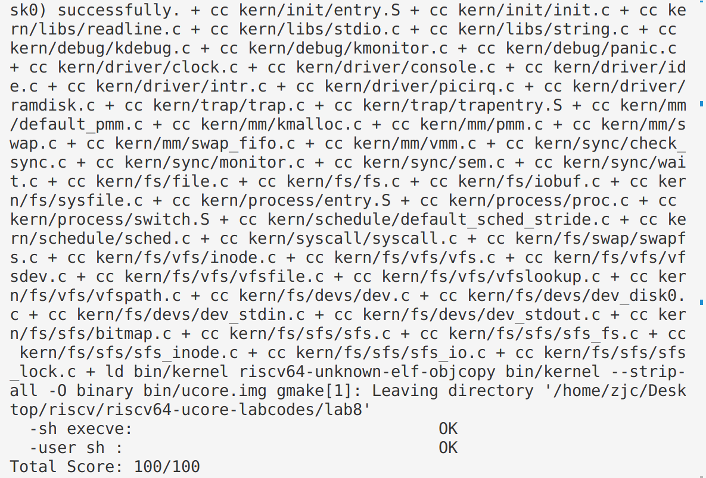
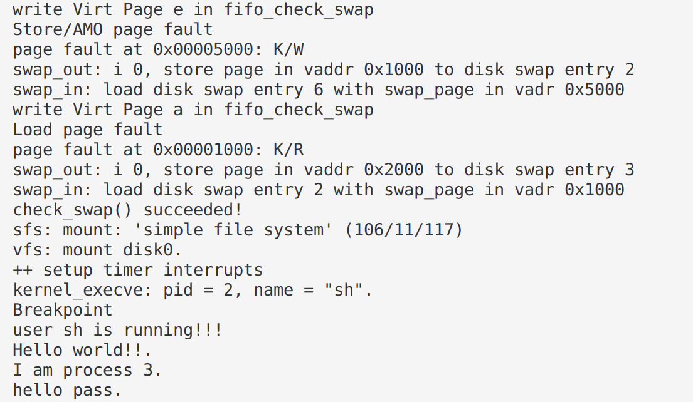

## 练习1: 完成读文件操作的实现（需要编码）
> 首先了解打开文件的处理流程，然后参考本实验后续的文件读写操作的过程分析，填写在 kern/fs/sfs/sfs_inode.c中 的sfs_io_nolock()函数，实现读文件中数据的代码。

函数主要是从文件的磁盘块中读取数据到内存，或者将内存中的数据写入到文件的磁盘块中，再对读写的起始和结束位置进行了合法性检查，避免非法访问。同时通过一系列的函数指针（sfs_buf_op和sfs_block_op）选择读写缓冲区或磁盘块的操作。

```C
static int
sfs_io_nolock(struct sfs_fs *sfs, struct sfs_inode *sin, void *buf, off_t offset, size_t *alenp, bool write) {
    struct sfs_disk_inode *din = sin->din;
    assert(din->type != SFS_TYPE_DIR);
    // 确定读取的结束位置
    off_t endpos = offset + *alenp, blkoff;
    *alenp = 0;
	// calculate the Rd/Wr end position
    // 避免非法访问
    if (offset < 0 || offset >= SFS_MAX_FILE_SIZE || offset > endpos) {
        return -E_INVAL;
    }
    if (offset == endpos) {
        return 0;
    }
    if (endpos > SFS_MAX_FILE_SIZE) {
        endpos = SFS_MAX_FILE_SIZE;
    }
    if (!write) {
        if (offset >= din->size) {
            return 0;
        }
        if (endpos > din->size) {
            endpos = din->size;
        }
    }

    int (*sfs_buf_op)(struct sfs_fs *sfs, void *buf, size_t len, uint32_t blkno, off_t offset);
    int (*sfs_block_op)(struct sfs_fs *sfs, void *buf, uint32_t blkno, uint32_t nblks);
    if (write) {
        sfs_buf_op = sfs_wbuf, sfs_block_op = sfs_wblock;
    }
    else {
        sfs_buf_op = sfs_rbuf, sfs_block_op = sfs_rblock;
    }

    int ret = 0;
    size_t size, alen = 0;
    uint32_t ino;
    uint32_t blkno = offset / SFS_BLKSIZE;          // The NO. of Rd/Wr begin block
    uint32_t nblks = endpos / SFS_BLKSIZE - blkno;  // The size of Rd/Wr blocks

  //LAB8:EXERCISE1 YOUR CODE HINT: call sfs_bmap_load_nolock, sfs_rbuf, sfs_rblock,etc. read different kind of blocks in file
	/*
	 * (1) If offset isn't aligned with the first block, Rd/Wr some content from offset to the end of the first block
	 *       NOTICE: useful function: sfs_bmap_load_nolock, sfs_buf_op
	 *               Rd/Wr size = (nblks != 0) ? (SFS_BLKSIZE - blkoff) : (endpos - offset)
	 * (2) Rd/Wr aligned blocks 
	 *       NOTICE: useful function: sfs_bmap_load_nolock, sfs_block_op
     * (3) If end position isn't aligned with the last block, Rd/Wr some content from begin to the (endpos % SFS_BLKSIZE) of the last block
	 *       NOTICE: useful function: sfs_bmap_load_nolock, sfs_buf_op	
	*/
    // nblks：表示要操作的块的数量。
    // SFS_BLKSIZE：表示一个块的大小。
    // blkoff：表示在块内的偏移量。
    // endpos：表示操作的结束位置。
    // offset：表示操作的开始位置。
    // 非对齐的第一块
    if ((blkoff = offset % SFS_BLKSIZE) != 0|| endpos / SFS_BLKSIZE == offset / SFS_BLKSIZE)  {
        // 找到第一块中要读的大小
        size = (nblks != 0) ? (SFS_BLKSIZE - blkoff) : (endpos - offset);
         // 将数据块对应到磁盘上的数据块的编号给ino
        if ((ret = sfs_bmap_load_nolock(sfs, sin, blkno, &ino)) != 0) 
        {
            goto out;
        }

        if ((ret = sfs_buf_op(sfs, buf, size, ino, blkoff)) != 0) 
        {
            goto out;
        }
        alen += size;
        if (nblks == 0)
        {
            goto out;
        }
        buf += size;
        blkno++;
        nblks--;
    }

    // 循环读取对齐的中间块
    size = SFS_BLKSIZE;
    while (nblks != 0) { 
        if ((ret = sfs_bmap_load_nolock(sfs, sin, blkno, &ino)) != 0) {
            goto out;
        }

        // 完整块
        if ((ret = sfs_block_op(sfs, buf, ino, 1)) != 0) { 
            goto out;
        }
        alen += size, buf += size, blkno++, nblks--;
    }

    // 末尾没对齐，同上
    if ((size = endpos % SFS_BLKSIZE) != 0) {
        if ((ret = sfs_bmap_load_nolock(sfs, sin, blkno, &ino)) != 0) {
            goto out;
        }
        if ((ret = sfs_buf_op(sfs, buf, size, ino, 0)) != 0) {   
            goto out;
        }
        alen += size;
    }
    

out:
    *alenp = alen;
    if (offset + alen > sin->din->size) {
        sin->din->size = offset + alen;
        sin->dirty = 1;
    }
    return ret;
}
```
主要步骤：

- 根据偏移量计算读写结束位置（endpos）。
- 针对不同情况进行一系列合法性检查和处理。
- 根据读写类型（read/write）选择相应的操作函数指针。
- 通过循环和函数调用完成对不同块的读写操作,主要分成三部分，如果开始的偏移量不是块大小的整数倍，函数读取或写入第一个块的一部分，函数读取或写入一系列完整的块，如果结束位置不是块大小的整数倍，函数读取或写入最后一个块的一部分。


## 实验结果


